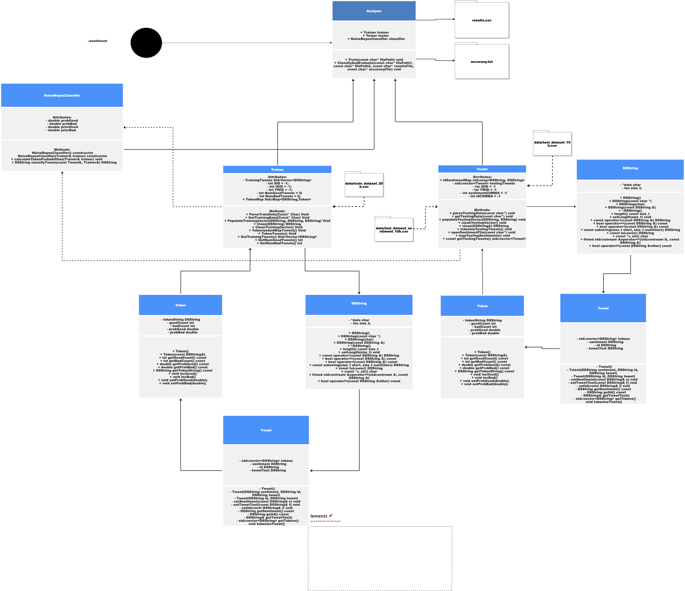
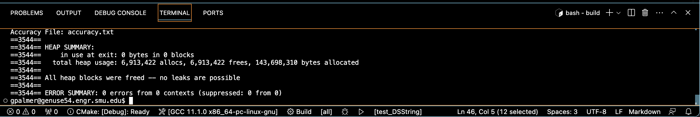

# Assignment 2: Answers

**Complete this document, commit your changes to Github and submit the repository URL to Canvas.** Keep your answers short and precise.

Your Name: Grant Palmer

Used free extension: [ ] 24 hrs or [x] 48 hrs

[ ] Early submission (48 hrs)

[x] Bonus work. Describe: Have a 74% accuracy for classification of tweets

Place [x] for what applies.

## UML Diagram

Add your UML class diagram here.

Replace the following image with your diagram. You can draw it by hand and take a photo.

## Answers

1. How do you train the model and how do you classify a new tweet? Give a short description of the main steps.

    > 1. I import the training dataset and after successfully parsing through that, I fill a vector of Tweet objects with that information.
    2. From there I clean and tokenize each individual tweet fro the trainingTweet dataset and create Tokens out of each token in tweet with a corresponding count of how many times it appears in a good or bad tweet from the training dataset. 
    3. I map each DSString token to an actual Token object, This helps me initialize probabilities and calculate them later on. 
    4. From there I read in the testing tweets and do a similar process of populating, cleaning and tokenizing, and then FOR each token in current testingTweet, I see if it exists in our tokenMap from training data, and use
    5. Map is cleaned of basic tokens, I played around with this to find the best accuracy
    6. The log of the prior probabilities for good and bad tweets are initialized, and for each token in the tweet, the log probabilities are added to the running totals for good and bad tweets.
    7. The tweet is classified as good or bad based on which total probability is higher.

2. How long did your code take for training and what is the time complexity of your training implementation (Big-Oh notation)? Remember that training includes reading the tweets, breaking it into words, counting, ... Explain why you get this complexity (e.g., what does `N` stand for and how do your data structures/algorithms affect the complexity).

   >  Training Complexity: O(1) + O(N) + O(N * M): O(1) for reading headers + O(N) for reading and parsing trainingData + O(N * M) for cleaning the trainingTweets

Here, N stands for the number of elements in the input aka the trainingData file. We add it to a vector of length N. The choice of data structure can impact both time and space complexities. Like using a hash table vs a map could  reduce the time complexity for look-up operations to O(1) in stead O(log n), but it might increase the space complexity. I chose to use a map which has an average search complexity of O(log n) for more efficient searching and look of tokens instead of choosing to iterate through a vector and potentially getting a worse case of O(N).

3. How long did your code take for classification and what is the time complexity of your classification implementation (Big-Oh notation)? Explain why.

   >  O(N) + O(N*M) + O(N*T): O(N) for reading and parsing testingData + O(N * M) for cleaning testingTweets + O(N * T) for classification (going through map of tokens)

4. How do you know that you use proper memory management? I.e., how do you know that you do not have
   a memory leak?

   > 

   Based off my valgrind statement, upon exiting my program 0 bytes in 0 blocks are in use, all 6.9million allocationss and 6.9million frees. ALL HEAP BLOCKS WERE FREED NO LEAKS ARE POSSIBLE

5. What was the most challenging part of the assignment?

   > The most challenging part of this assignment was implementing a custom String class to run such a "string" heavy program, but it also gave  a lot more freedom to add things as I needed. But because I constructed this from scratch, although my program was running, it was very error prone, adding a random character here, and there, pointer to a wrong location, accessing out of bounds indices in my DSString all were just a few of the most challening parts of implementing this assignment. Figuring out how to parse a csv file to pick the right fields also was challening to figure out at first, but after that it was a simple copy of code for my other functions and a few modifications.